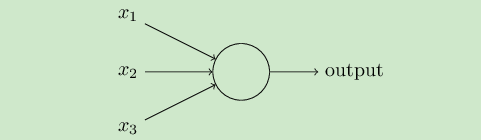

# DNN学习

> author : 🐋

DNN是什么？他是`Deep Neural Network`深度神经网络，也被叫做`MLP`也就是多层感知机

参考了https://zhuanlan.zhihu.com/p/29815081

## 从感知机到神经网络

在感知机中，输出和输入之间学习到一个线性关系，得到中间输出结果

$$
z = \sum_{i=1}^m w_ix_i+b
$$

紧接着是一个神经元激活函数
$$
sign(z)=-1(if \ z < 0) 1 (if \ z \ge 0)
$$

